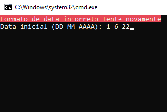

# Etiqueta c/ Estoque - FACILITE

Projeto desenvolvido para automatizar um processo manual, no qual é necessário ser feito devido a falta de uma funcionalidade nativa no sistema FACILITE.

O repositório contém duas versões do projeto:

- Script escrito em `batch`
- Aplicação Desktop com `electron`

O script fornece uma operação mais rápida e conta validações avançadas para verificação das datas inseridas. <br>
A aplicação funciona da mesma forma porém com uma interface gráfica amigável e bastante simples de utilizar.

## Script `Batch`

> Certifique-se que o banco de dados está no local padrão de instalação `C:\SINCO\INTEGRADO\FACILITE.FDB`

Para utilizar, vá até a pasta batch/ e execute o script.


<table>
    <tr>
        <td></td>
        <td></td>
        <td></td>
    </tr>
    <tr>
        <td></td>
        <td></td>
        <td></td>
    </tr>
</table>

## Aplicação `Electron`

> Certifique-se que o banco de dados está no local padrão de instalação `C:\SINCO\INTEGRADO\FACILITE.FDB`

Para utilizar, vá até a pasta electron e execute os seguintes comandos:

```sh
npm install # Instalar as dependências
npm start # Execução
npm run package # Gerar o binário executável
```

<table>
    <tr>
        <td></td>
        <td></td>
        <td></td>
    </tr>
</table>